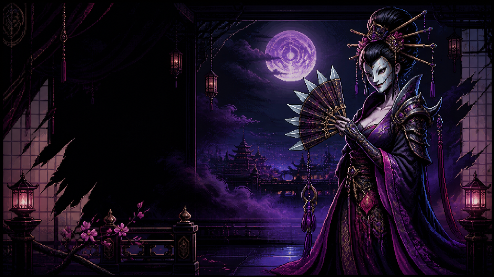

# The Sixfold Bloom

An unofficial pixel-art fan tribute to the **Hedonites of Slaanesh** from *Warhammer Age of Sigmar*. The page presents faction lore through a sinister, courtly fantasy aesthetic inspired by 16-bit role-playing games.



## Highlights

- Original high-detail pixel-art hero scene
- Responsive lacquer-black, orchid, cyan, and gold interface
- Short introductions to Blissbarb Archers, Slickblade Seekers, and Shardspeakers
- Interactive six-offer temptation ritual
- Dynamic depravity score, progress meter, and outcomes
- Keyboard-accessible navigation and focusable faction cards
- Small dependency-free Node.js static server

## Run locally

The project requires a recent version of [Node.js](https://nodejs.org/). It has no third-party runtime dependencies.

```bash
npm start
```

Open [http://127.0.0.1:4173](http://127.0.0.1:4173) in a browser.

The server binds to `127.0.0.1`, so it is available only on the local machine. To use another port:

```bash
PORT=8080 npm start
```

## Stop the server

If the server is running in the current terminal, press:

```text
Ctrl+C
```

If it was started in the background, find and stop the process listening on port `4173`:

```bash
lsof -ti :4173 | xargs kill
```

Replace `4173` with the value of `PORT` if you started the server on a different port.

## Project structure

```text
.
├── public/
│   ├── assets/
│   │   └── court-of-excess.png
│   ├── app.js
│   ├── index.html
│   └── styles.css
├── package.json
└── server.mjs
```

## Design and lore notes

The visual direction combines crisp retro-console pixel art with an original masked pleasure-court concept. Its silks, jewelled ornament, poisonous colors, perfumed fog, and temptation mechanic draw from the Hedonites' established themes of elegance, excess, speed, and danger.

The hero artwork was generated specifically for this project. It is an original fan interpretation and does not reproduce a named character, miniature, logo, or official illustration.

Useful official references:

- [Hedonites of Slaanesh faction focus](https://www.warhammer-community.com/en-gb/articles/b3l8nCD7/warhammer-age-of-sigmar-faction-focus-hedonites-of-slaanesh/)
- [Temptations of Slaanesh](https://www.warhammer-community.com/en-gb/articles/qjeL6D0s/use-guaranteed-sixes-to-tempt-your-foes-with-battletome-hedonites-of-slaanesh/)

## Disclaimer

This is an unofficial, non-commercial fan project. It is not affiliated with, endorsed by, or sponsored by Games Workshop.

*Warhammer Age of Sigmar*, *Hedonites of Slaanesh*, Slaanesh, and all associated names, characters, settings, and marks are the property of their respective owners. No challenge to those rights is intended.
